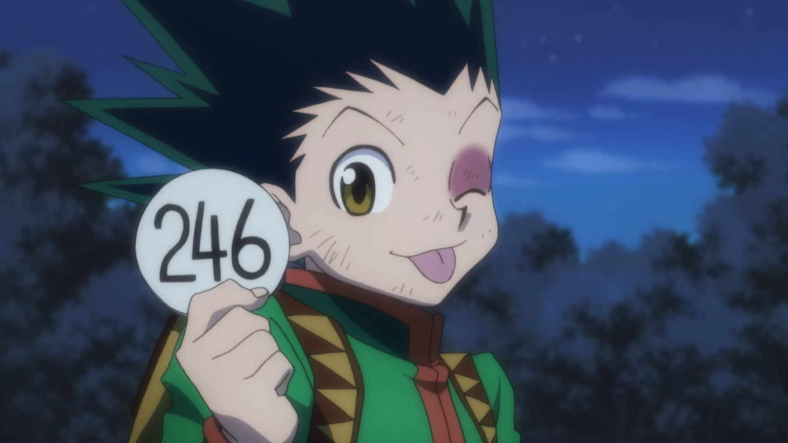

# 24stefan  
`backend / game dev`

---

## Contact

---

---

## Tech Stack

  
  
    <!-- Rotating framework icons as GIF. -->
    
  

---

## About Me  
Backend specialist & game dev. Passionate about systems architecture, multiplayer frameworks and building scalable real-time applications.

---

## GitHub Trophies  

---
